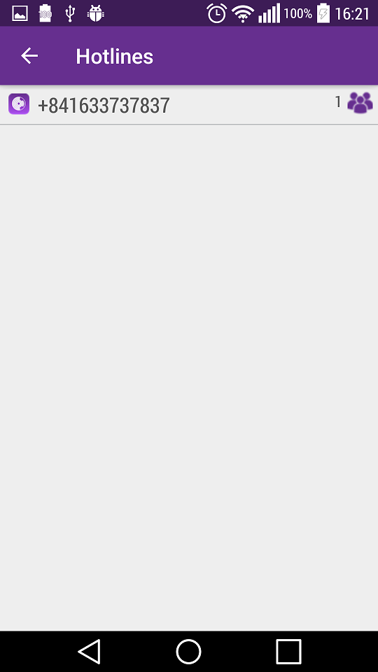
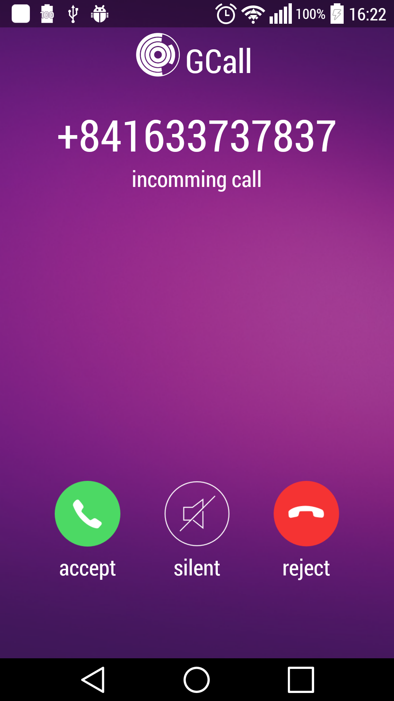
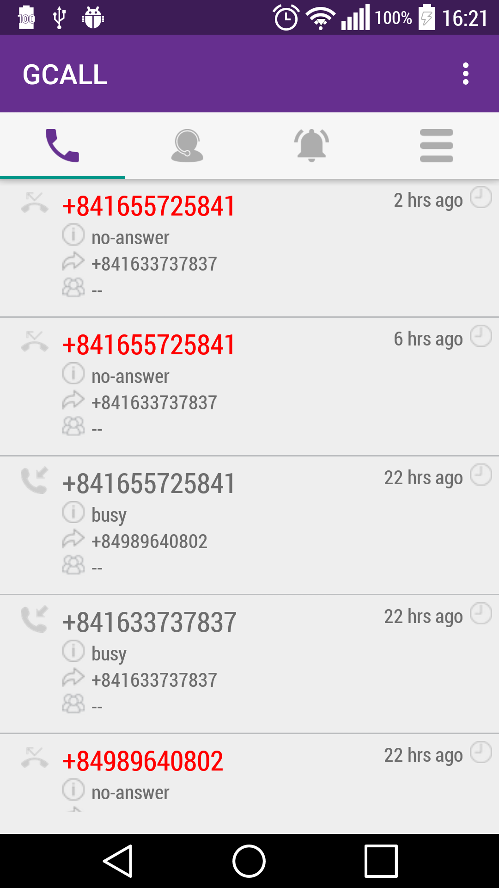
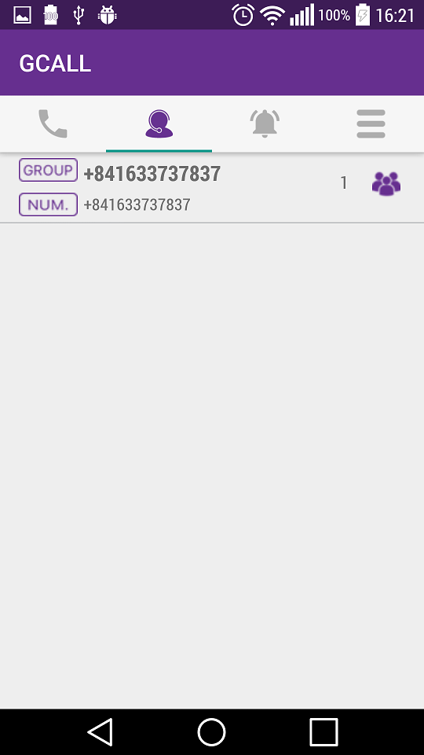
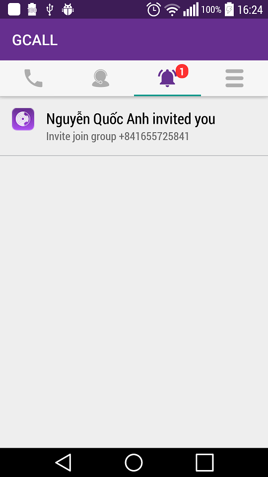
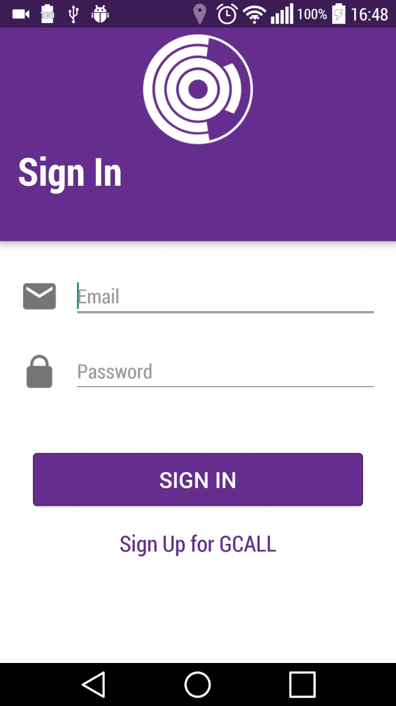
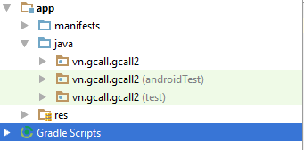

# GCALL-2-Android
Gcall brings a platform for SMEs and online stores  to support their customer better
## Geting Started
### Installation
&nbsp;Pull or download project as zip and use Android studio to build and run
## Features
* Manage hotline by adding or deleting agents 
  
* Receive in coming call from clients 
  
* All calls history is shown 
  
* Show all co-worker in the same hotlines with you 
  
* You can accept or reject the invitation to a hotline 
  

## Work flow
  

## Project folder

## Build with
* Twillio client  android <https://www.twilio.com/docs/api/client/android>
* Android view badgers <https://github.com/jgilfelt/android-viewbadger>
* Volley library <https://github.com/mcxiaoke/android-volley>
* Floating action menu and button <https://github.com/futuresimple/android-floating-action-button>
* Text drawable <https://github.com/amulyakhare/TextDrawable>
* Country code picker <https://github.com/hbb20/CountryCodePickerProject>
* Progress dialog <https://github.com/d-max/spots-dialog>
* App introduction <https://github.com/PaoloRotolo/AppIntro>
* Firebase cloud messaging <https://firebase.google.com>

## Authors
 &nbsp; Dong Tan Huy <huy.dong@gpat.vn> - Android Developer at GPAT Company
# License
&nbsp;This project is licensed under the MIT License
## Acknowledgments

* This version is not in any architecture
* It's quite hard to read :)
* It's better to be refactored in Clean Architecture
